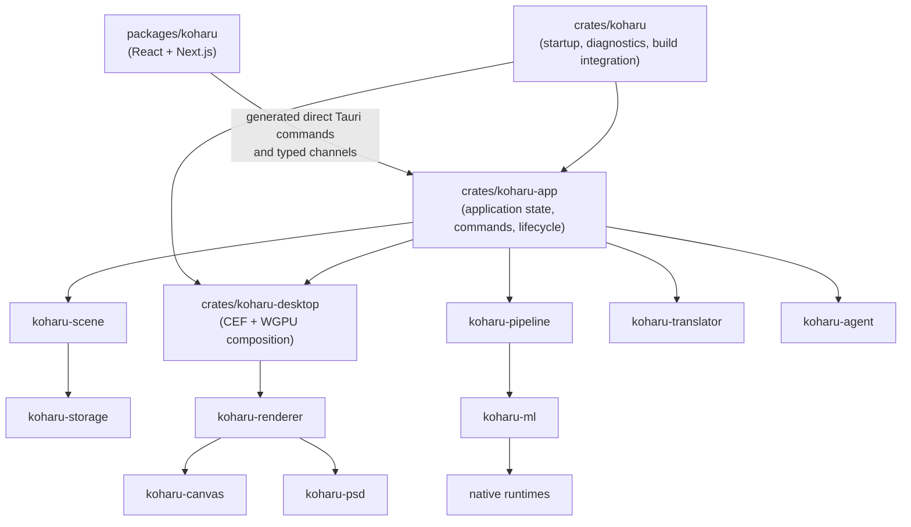

# Architecture

Koharu is one desktop application, not a web client attached to a separate server.

## Frontend

`packages/koharu` owns product presentation and interaction state: project browser, page rail, canvas controls, inspector, settings, resource activity, and Agent panel. `packages/ui` owns reusable React primitives and styling.

The frontend invokes named Tauri commands directly. It does not maintain an HTTP client or decode a generic application event envelope.

## Application

`crates/koharu` owns process startup, diagnostics, Tauri configuration, and build integration. It composes `koharu-app` with `koharu-desktop`. `koharu-app` owns Tauri-managed state, project lifecycle, command serialization, processing jobs, desktop synchronization, and agent hosting. Independent typed channels publish project, canvas, job, download, preference, and resource updates.

Rust signatures generate `packages/koharu/lib/protocol.ts`; that file is derived output.

## Domain and durability

`koharu-scene` is the canonical typed in-memory project. It owns page hierarchy, semantic components, relations, patches, revisions, and session undo. `koharu-storage` owns opaque complete state payloads and immutable blob bytes on disk.

## Processing and translation

`koharu-pipeline` owns the fixed page workflow, model lifetime, scheduling, progress, stop semantics, and incremental stage commits. `koharu-ml` owns model implementations and the shared device abstraction. `koharu-translator` owns local and hosted translation connectivity.

## Rendering and desktop composition

`koharu-renderer` interprets one scene page into retained vector content. `koharu-canvas` presents and interacts with that content. PNG and PSD start from the same retained frame. `koharu-desktop` composites the native canvas first and the off-screen CEF interface above it into one WGPU window surface.

## Native bindings

Safe Rust wrappers (`koharu-torch`, `koharu-llama`, and `koharu-diffusion`) are separated from their unsafe `-sys` dynamic-loading crates. `koharu-runtime` discovers, downloads, validates, and loads native packages.
