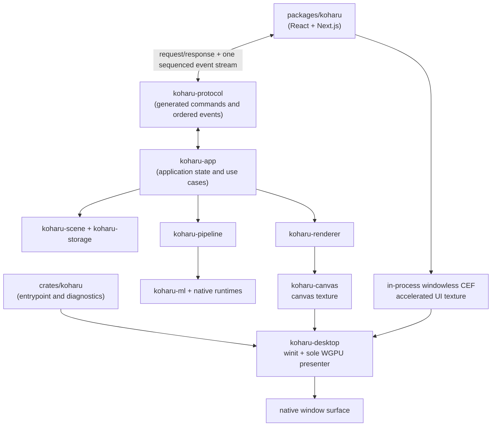

# Architecture

Koharu is one desktop application, not a web client attached to a separate server. Its native shell follows one strict presentation rule: one winit window, one WGPU surface, and one presenter that alone acquires and presents surface textures.

## Frontend and protocol

`packages/koharu` owns product presentation and interaction state: project browser, page rail, canvas controls, inspector, settings, resource activity, and Agent panel. React continues to own hit testing, gestures, and control geometry over the canvas.

The frontend sends typed requests identified by request IDs and consumes one ordered application-event stream. Startup success and failure, project changes, canvas state, jobs, downloads, resources, Agent progress, and window state all use that stream. A sequence gap is an error rather than permission to apply potentially inconsistent later state. Binary results travel as transferable byte attachments, not base64.

`koharu-protocol` owns the transport-neutral Rust request, response, error, and event schema. Rust declarations generate `packages/koharu/lib/protocol.ts`; never hand-edit that derived file. The CEF bridge transports the schema but does not own application behavior.

## Application and domain

`crates/koharu` owns only process entry, diagnostics, and early CEF subprocess dispatch. `koharu-app` owns project lifecycle, processing jobs, renderer coordination, preferences, and Agent hosting. Application code does not own a native window or WGPU surface.

`koharu-scene` is the canonical typed in-memory project. It owns page hierarchy, semantic components, relations, patches, revisions, and session undo. `koharu-storage` owns opaque complete state payloads and immutable blob bytes on disk.

`koharu-pipeline` owns the fixed page workflow, model lifetime, scheduling, progress, stop semantics, and incremental stage commits. `koharu-ml` owns model implementations and the shared device abstraction. `koharu-translator` owns local and hosted translation connectivity.

## Rendering and desktop ownership

`koharu-renderer` interprets one scene page into retained vector content. `koharu-canvas` renders and interacts with that content in a GPU texture. PNG and PSD start from the same retained frame.

`koharu-desktop` owns the winit event loop, sole native window, WGPU device and queue, sole surface, input forwarding, in-process windowless CEF browser, and final compositor. Chromium's required renderer/GPU helpers still re-enter the same executable through CEF's normal subprocess dispatch, but Koharu does not run a separate browser-host service or frame IPC protocol. CEF never creates or presents an operating-system window. Its windowless renderer normally supplies a D3D11 shared texture, DMA-BUF, or IOSurface. cef-rs imports that resource into the presenter's WGPU 30 device, and Koharu copies and crops it into an owned UI texture before CEF reclaims the resource. The presenter composites that texture over the canvas and performs the only surface presentation.

If the selected backend cannot import the platform texture or an accelerated paint fails, Koharu recreates the browser with CEF software painting. The accelerated path avoids CPU readback and upload but intentionally performs one GPU copy because CEF forbids retaining its pooled shared resource after the paint callback.

## Upstream ownership reference

This desktop split is structurally aligned with [Graphite commit `a0349236952b27759284682151f04d84d0cd3636`](https://github.com/GraphiteEditor/Graphite/tree/a0349236952b27759284682151f04d84d0cd3636): application messages remain independent of the browser transport, while the native shell owns the window, event loop, compositor, accelerated texture import, and GPU presentation. Koharu's domain and protocol remain its own; the pinned Graphite snapshot is the architectural reference, not a source-code port.

## FFI bindings

Safe Rust wrappers (`koharu-torch`, `koharu-llama`, and `koharu-diffusion`) are separated from their unsafe `-sys` dynamic-loading crates. `koharu-runtime` discovers, downloads, validates, and loads native model packages. CEF dynamic loading, helper-process dispatch, and cef-rs external-memory import remain isolated from the safe desktop API.
