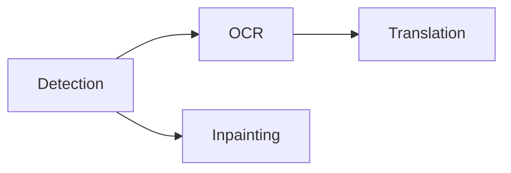

# Pipeline, Rendering, and Desktop Composition

## Fixed pipeline

`koharu-pipeline` coordinates a small named workflow rather than a runtime graph:

An execution unit is one stage on one page. Pages enter in project order, but a completed detection immediately makes that page's dependent branches eligible. There is no global “finish detection everywhere first” barrier.

Each stage produces a semantic scene patch. The application commits it immediately, synchronizes the current canvas, and groups all revisions from one invocation into one undo step.

## Scheduling and residency

Accelerator inference uses one admission lane because representative heterogeneous overlap reduced throughput through compute and memory-bandwidth contention. CPU-only execution can retain independent per-model lanes.

Models load lazily and remain available for reuse. The residency manager observes resident and peak workspace memory, keeps a safety margin, evicts idle models in least-recently-used order when needed, and retries one learned out-of-memory case after cleanup.

Stopping is cooperative. No new stage starts after the stop request; an active native call returns safely, and its result is discarded if it has not committed.

## Retained rendering

`koharu-renderer::Renderer` turns a scene snapshot and page ID into one immutable `Frame`. The frame contains ordered retained layers, entity lookup, presentation metadata, dependencies, diagnostics, and vector scenes.

Scene translation is the only visible text source. Typography, fit relations, fonts, images, visibility, and opacity all come from scene data. The renderer loads resources and retains reusable nodes; callers do not provide an alternate document model.

The canvas, flattened PNG, layer crops, and PSD adapter consume this same frame. Incremental renderer updates reuse unchanged nodes but must produce the same result as a complete render.

## Desktop composition

The WebView draws interface chrome, menus, controls, and inspectors. It stays transparent over the canvas region. Native WGPU/Vello output is composed beneath it in the same desktop window.

Validate visual changes through the final desktop window. A WebView screenshot alone cannot prove that native canvas pixels are present, and a native render alone cannot prove that transparency and interface composition are correct.

On Windows, the development WebView2 endpoint is `http://127.0.0.1:4000`; use semantic CDP inspection for the web layer and native window capture for the final composite.
