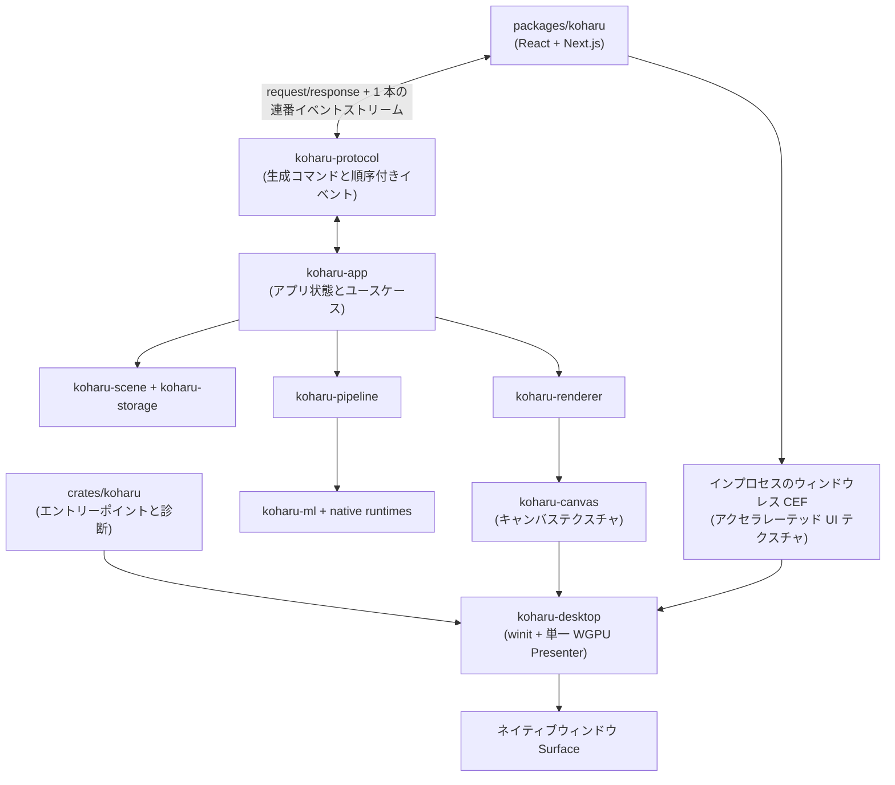

# アーキテクチャ

Koharu は別サーバーへ接続する Web クライアントではなく、1 つのデスクトップアプリです。ネイティブシェルは「1 つの winit ウィンドウ、1 つの WGPU Surface、Surface の取得と Present を行う 1 つの Presenter」という規則に従います。

## フロントエンドとプロトコル

`packages/koharu` はプロジェクトブラウザー、ページレール、キャンバス操作、インスペクター、設定、リソースアクティビティ、Agent パネルを所有します。キャンバス上のヒットテスト、ジェスチャー、操作部のジオメトリは引き続き React が所有します。

フロントエンドは request ID 付きの型付きリクエストを送り、1 本の順序付きアプリイベントストリームを受信します。起動成功・失敗、プロジェクト、キャンバス、ジョブ、ダウンロード、リソース、Agent、ウィンドウ状態はすべてこのストリームを使います。連番に欠落があれば、後続の不整合な状態を適用せずエラーにします。バイナリ結果は Base64 ではなく転送可能なバイト添付です。

`koharu-protocol` はトランスポートに依存しない Rust の request、response、error、event スキーマを所有します。Rust 宣言から `packages/koharu/lib/protocol.ts` を生成するため、この派生ファイルを手編集しないでください。CEF ブリッジはスキーマを運びますが、アプリの動作は所有しません。

## アプリとドメイン

`crates/koharu` はプロセスのエントリーポイント、診断、早期の CEF サブプロセス振り分けだけを所有します。`koharu-app` はプロジェクトライフサイクル、処理ジョブ、Renderer の調整、設定、Agent ホストを所有します。アプリコードはネイティブウィンドウや WGPU Surface を所有しません。

`koharu-scene` はページ階層、意味コンポーネント、関係、パッチ、リビジョン、セッション undo を持つ正規プロジェクトです。`koharu-storage` は不透明な完全状態ペイロードと不変 blob を永続化します。

`koharu-pipeline` は固定ワークフロー、モデル寿命、スケジューリング、進捗、停止、段階コミットを所有します。`koharu-ml` はモデルと共有デバイス、`koharu-translator` はローカル・ホスト翻訳接続を所有します。

## レンダリングとデスクトップ所有権

`koharu-renderer` はシーンページを保持ベクターへ変換します。`koharu-canvas` はその内容を GPU テクスチャへ描画して操作します。PNG と PSD も同じ保持フレームから始まります。

`koharu-desktop` は winit イベントループ、唯一のネイティブウィンドウ、WGPU Device と Queue、唯一の Surface、入力転送、インプロセスのウィンドウレス CEF Browser、最終 Compositor を所有します。Chromium に必要な Renderer/GPU ヘルパーは CEF の通常のサブプロセス分岐で同じ実行ファイルに再入しますが、Koharu 独自の Browser Host サービスや Frame IPC はありません。CEF は OS ウィンドウを作成せず、Present もしません。ウィンドウレス Renderer は通常、D3D11 共有テクスチャ、DMA-BUF、または IOSurface を渡します。cef-rs がそれを Presenter と同じ WGPU 30 Device に import し、Koharu は CEF がリソースを回収する前に、クロップした所有 UI テクスチャへ GPU コピーします。Presenter はその UI テクスチャをキャンバス上へ合成し、唯一の Surface Present を行います。

選択した Backend がプラットフォームテクスチャを import できない場合、または accelerated paint が失敗した場合は、CEF のソフトウェア描画で Browser を再作成します。アクセラレーテッド経路は CPU readback と upload を避けますが、CEF の共有リソースを callback 後まで保持できないため、GPU コピーを 1 回行います。

## 上流の所有権モデル

このデスクトップ分割は [Graphite commit `a0349236952b27759284682151f04d84d0cd3636`](https://github.com/GraphiteEditor/Graphite/tree/a0349236952b27759284682151f04d84d0cd3636) と構造的に揃えています。アプリケーションメッセージはブラウザートランスポートから独立し、ネイティブシェルがウィンドウ、イベントループ、Compositor、accelerated texture import、GPU Present を所有します。Koharu のドメインとプロトコルは独自であり、この固定 Graphite スナップショットはソースコード移植ではなくアーキテクチャ参照です。

## ネイティブ境界

安全な Rust ラッパー (`koharu-torch`、`koharu-llama`、`koharu-diffusion`) は unsafe な `-sys` 動的ロードクレートと分離されています。`koharu-runtime` はネイティブモデルパッケージを検出、ダウンロード、検証、ロードします。CEF の動的ロード、ヘルパープロセス分岐、cef-rs の外部メモリ import も安全なデスクトップ API から分離します。
