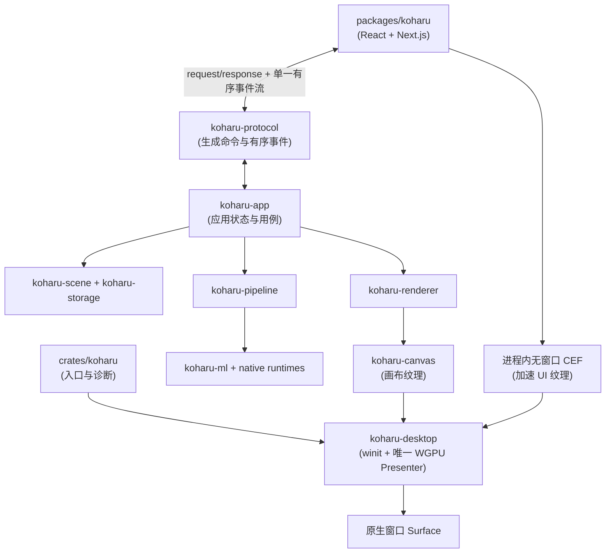

# 架构

Koharu 是单体桌面应用，不是连接独立服务器的 Web 客户端。原生外壳遵守一条严格规则：一个 winit 窗口、一个 WGPU Surface，以及唯一能够获取和呈现 Surface 纹理的 Presenter。

## 前端与协议

`packages/koharu` 拥有项目浏览器、页面栏、画布控制、检查器、设置、资源活动和智能体面板。画布上的命中测试、手势与控件几何仍由 React 拥有。

前端发送带 request ID 的类型化请求，并消费一条有序应用事件流。启动成功或失败、项目、画布、任务、下载、资源、智能体进度与窗口状态都使用这条事件流。序列出现缺口时会报错，而不是继续应用可能不一致的后续状态。二进制结果使用可转移字节附件，不编码为 Base64。

`koharu-protocol` 拥有与传输无关的 Rust request、response、error 和 event 模式。Rust 声明生成 `packages/koharu/lib/protocol.ts`；不要手工编辑该派生文件。CEF 桥接层只传输协议，不拥有应用行为。

## 应用与领域

`crates/koharu` 只拥有进程入口、诊断和早期 CEF 子进程分派。`koharu-app` 拥有项目生命周期、处理任务、Renderer 协调、设置和智能体宿主。应用代码不拥有原生窗口或 WGPU Surface。

`koharu-scene` 是权威内存项目，拥有页面层级、语义组件、关系、补丁、修订与会话撤销。`koharu-storage` 负责磁盘上的不透明完整状态和不可变 blob。

`koharu-pipeline` 拥有固定页面工作流、模型生命周期、调度、进度、停止与阶段提交。`koharu-ml` 拥有模型和共享设备抽象，`koharu-translator` 拥有本地及托管翻译连接。

## 渲染与桌面所有权

`koharu-renderer` 把场景页解释为保留矢量内容。`koharu-canvas` 在 GPU 纹理中绘制并交互这些内容。PNG 与 PSD 也从同一保留帧开始。

`koharu-desktop` 拥有 winit 事件循环、唯一原生窗口、WGPU Device 与 Queue、唯一 Surface、输入转发、进程内无窗口 CEF Browser 和最终 Compositor。Chromium 必需的 Renderer/GPU 辅助进程仍通过 CEF 的标准子进程分派重新进入同一可执行文件，但 Koharu 不再运行单独的 Browser Host 服务或 Frame IPC。CEF 不创建或呈现操作系统窗口。无窗口 Renderer 通常提供 D3D11 共享纹理、DMA-BUF 或 IOSurface。cef-rs 将资源导入 Presenter 使用的同一 WGPU 30 Device，Koharu 在 CEF 回收资源前，将其裁剪并复制到自己拥有的 UI 纹理。Presenter 把 UI 纹理合成到画布之上，并执行唯一的 Surface Present。

如果所选 Backend 无法导入平台纹理，或 accelerated paint 失败，Koharu 会使用 CEF 软件绘制重新创建 Browser。加速路径避免 CPU readback 和 upload，但由于 CEF 禁止在 paint callback 之后持有其池化共享资源，因此会执行一次 GPU 复制。

## 上游所有权参考

此桌面分层在结构上与 [Graphite commit `a0349236952b27759284682151f04d84d0cd3636`](https://github.com/GraphiteEditor/Graphite/tree/a0349236952b27759284682151f04d84d0cd3636) 对齐：应用消息独立于浏览器传输，原生外壳拥有窗口、事件循环、合成器、加速纹理导入与 GPU 呈现。Koharu 的领域与协议仍为自身实现；固定的 Graphite 快照是架构参考，并非源码移植。

## 原生边界

安全 Rust 包装层（`koharu-torch`、`koharu-llama` 和 `koharu-diffusion`）与 unsafe `-sys` 动态加载 crate 分离。`koharu-runtime` 发现、下载、验证并加载原生模型包。CEF 动态加载、辅助进程分派和 cef-rs 外部内存 import 同样与安全桌面 API 隔离。
