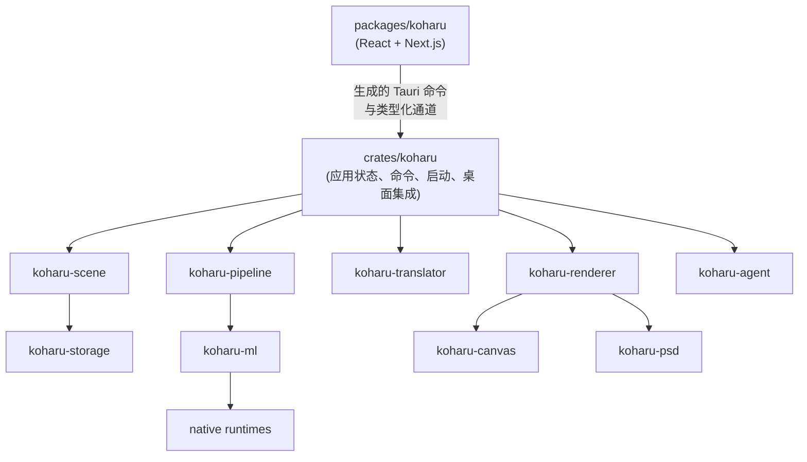

# 架构

Koharu 是单体桌面应用，不是连接独立服务器的 Web 客户端。

## 前端与应用

`packages/koharu` 拥有项目浏览器、页面栏、画布控制、检查器、设置、活动中心和智能体面板。`packages/ui` 拥有可复用 React 组件与样式。

前端直接调用具名 Tauri 命令，不维护 HTTP 客户端，也不解析通用应用事件信封。

`crates/koharu` 拥有启动、诊断、Tauri 状态、项目生命周期、命令串行化、处理任务、桌面同步和智能体宿主。独立类型化通道发布项目、画布、任务、下载、偏好和资源更新。`protocol.ts` 由 Rust 签名生成。

## 领域、处理与渲染

`koharu-scene` 是权威内存项目，拥有页面层级、语义组件、关系、补丁、修订与会话撤销。`koharu-storage` 负责磁盘上的不透明完整状态和不可变 blob。

`koharu-pipeline` 拥有固定页面工作流、模型生命周期、调度、进度、停止与阶段提交。`koharu-ml` 拥有模型和共享设备抽象，`koharu-translator` 拥有本地及托管翻译连接。

`koharu-renderer` 把场景页解释为保留矢量内容，`koharu-canvas` 与 PNG/PSD 共用该帧。WebView 界面保持透明，原生 GPU 画布合成在同一窗口下方。

安全 Rust 包装层与 unsafe `-sys` 动态加载 crate 分离。
