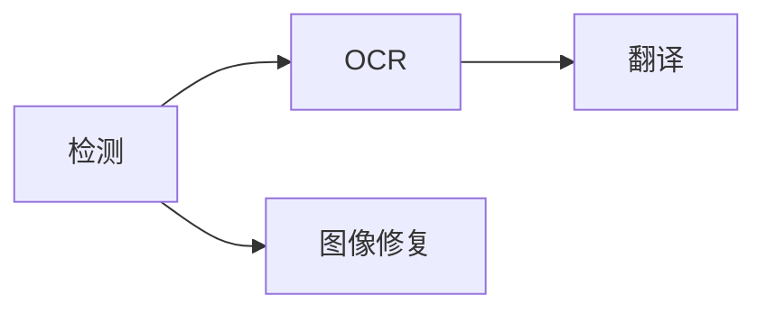

# 流水线、渲染与桌面合成

## 固定流水线

`koharu-pipeline` 协调一套小型具名流程，而不是运行时图：

执行单位是一页上的一个阶段。页面按项目顺序进入，但检测完成后会立即让该页后续分支就绪，不存在“先检测完所有页面”的全局屏障。

每个阶段生成语义场景补丁。应用立即提交它、同步当前画布，并把一次调用产生的所有修订组合为一个撤销步骤。

## 调度与驻留

代表性测试中，异构模型并行会因计算和内存带宽争用降低吞吐，因此加速器推理使用一个准入通道。纯 CPU 执行可以保留独立模型通道。

模型按需加载并驻留复用。驻留管理器观察常驻和峰值工作内存，保留安全余量，需要时按 LRU 卸载空闲模型，并在清理后对学习到的 OOM 重试一次。

停止是协作式的：不再开始新阶段，活动原生调用安全返回，尚未提交的结果会丢弃。

## 保留渲染

`Renderer` 从场景快照和页面 ID 构建不可变 `Frame`。它包含有序保留图层、实体查找、呈现元数据、依赖、诊断和矢量场景。

译文是唯一可见文字来源。排字、适配关系、字体、图像、可见性与不透明度都来自场景。画布、PNG、图层裁剪和 PSD 共用同一帧。增量更新可复用未变化节点，但结果必须与完整渲染一致。

## 桌面合成

桌面运行时拥有一个 winit 窗口和一个 WGPU Surface。`koharu-canvas` 把保留页面绘制到画布纹理。无窗口 CEF 把 React 窗口控件、菜单、操作控件与检查器绘制到平台共享纹理。cef-rs 将其导入同一 WGPU 30 Device，复制后的 UI 纹理中的透明像素会显示下方画布。

CEF 的池化资源仅在 accelerated paint callback 期间有效，因此 Koharu 会在 callback 返回前将其裁剪并复制到自己拥有的 GPU 纹理。Presenter 合成 UI 与画布纹理，并执行唯一的 Surface Present。有界的 latest-wins 进程内 mailbox 可避免无限的 Present backlog。如果 accelerated import 不可用或失败，Browser 会以软件绘制模式重新创建。

视觉修改必须通过最终桌面窗口验证。仅浏览器截图无法证明原生画布像素存在，仅画布 readback 也无法证明 alpha、操作控件与最终颜色合成正确。确定性的 Compositor 测试使用 off-screen WGPU readback，最终合成验证使用原生窗口捕获。
